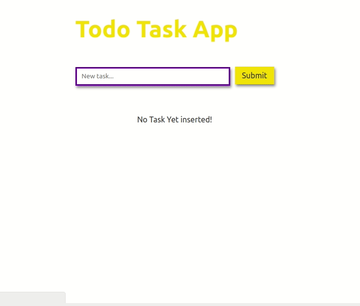

# Todo App Using Express, React, Node, and MongoDB

##### Live URL: https://todo-expr.herokuapp.com/

## Greate App For Learning, So use it

run the below command in project directory after cloning
#### `npm install`
#### `client-install`

now Start using
#### `node server.js`
#### `npm run client`

Thanks!
